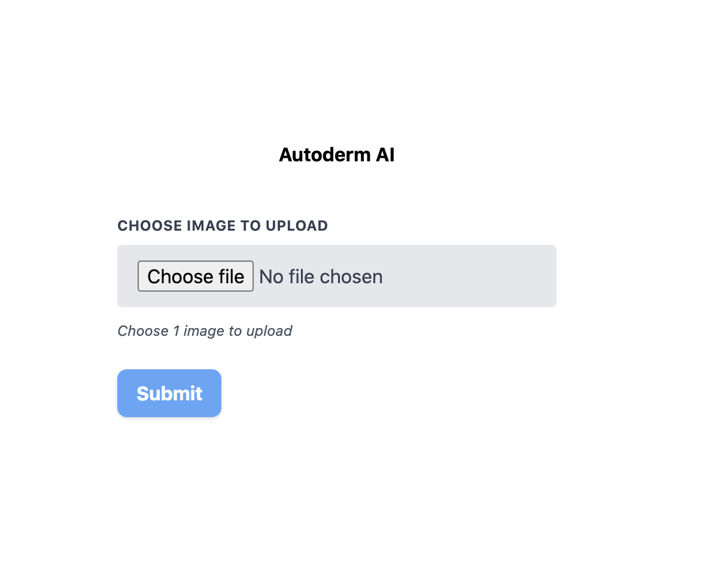

# AI dermatology app in 100 lines of code.

Deep learning has already shown its potential. At [FirstDerm](https://www.firstderm.com/) we are committed to a clear goal. Creating the best tool we can to help identify and diagnose dermatology images. That is why we created the [AI dermatology API]( https://www.firstderm.com/autoderm-dermatology-artificial-intelligence-ai-api/). By using it, you can have a tool at your disposal to recognize dermatology pathologies.

In this post we will show how to create a fully functional web application with, including a backend to interact with it. The best part is that it will take us less than 100 lines of code.

## The frontend (part 1)

For the frontend we are going to create 2 different html files. The code shown here can be easily written using React, Vue or any frontend framework.

First, we create an `index.html` with a very simple form. Here are the parts needed for the form.

```html
<form method="post" enctype="multipart/form-data" action="/img">
  <div>
    <div>
      <label for="sex">
        Age
      </label>
      <input id="age" name="age" type="number" required />
    </div>
    <div>
      <label for="sex">
        Sex
      </label>
      <select id="sex" name="sex" required>
        <option value="female">Male</option>
        <option value="male" selected>Female</option>
      </select>
    </div>
  </div>
  <div>
    <div>
      <label for="image_uploads">
        Choose images to upload
      </label>
      <input type="file" id="image_uploads" name="image_uploads" accept="image/*" required />
    </div>
  </div>
  <div>
    <div>
      <button type="submit" name="submit">
        Submit
      </button>
    </div>
  </div>
</form>
```

There are a couple of important things here:

First, note the line:  `<form method="post" enctype="multipart/form-data" action="/img">` the `action="/img"` part should be the endpoint where the form data is going to be uploaded. Now we are creating our own backend too. Lets say out main page is at `http://localhost`. The form data would be uploaded to `http://localhost/img`.

Take into account that in order to use [the API](https://www.firstderm.com/autoderm-dermatology-artificial-intelligence-ai-api/) you need to set the API key as a request header. That's why we are also building our backend. If you call the API directly from your website, your users may be able to get your API key and use it on their own. It's recommended that you first get the image in your ouwn backend. After that you can make a request to our API using all the appropiate settings. Without the risk of leaking sensitive information (like the API key).

Moving forward in our form. You can see we are also adding a few fields: **age**, **sex**, **image file** and a **message**. Our API can work using only the image, but it may be useful getting those extra values.

Note down the tag attributes `name` in each input. We will use those in our backend.

## The backend

For the backend we will use [FastAPI](https://fastapi.tiangolo.com/). A very developer-friendly and blazing fast python framework to create backend services.

Here is the full app, fully functional with only 43 lines of code. We'll now go through it.


```python
from fastapi import FastAPI, Form, UploadFile, Request  # , WebSocket
from fastapi.templating import Jinja2Templates
import requests
import os

templates = Jinja2Templates(directory=".")

headers = {"Api-Key": os.getenv("API_KEY")}

app = FastAPI()

@app.get("/")
async def index(request: Request):
    return templates.TemplateResponse("index.html", {"request": request})


@app.post("/img/")
async def process(
    *,
    age: int = Form(...),
    sex: str = Form(...),
    image_uploads: UploadFile = Form(...),
    request: Request,
):

    image_contents = await image_uploads.read()
    received_file = {"Image": image_contents}

    response = requests.post(
        os.getenv("API_URL", "https://autoderm-api.firstderm.com/Query"),
        headers=headers,
        files=received_file,
        data={"AgeYears": age, "Sex": sex, "Language": "EN", "Model": "43PLUS_noo_v3"},
    )

    data = response.json()

    predictions = data["predictions"]

    return templates.TemplateResponse(
        "prediction.html", {"request": request, "predictions": predictions}
    )
```

After import the necessary libraries, we set up a couple of configuration variables:

```python
templates = Jinja2Templates(directory=".")

headers = {"Api-Key": os.getenv("API_KEY")}
```

* `templates`: Tells our app we are out html files. In this case we are also using FastAPI to render the frontend.
* `headers`: A dictionary to set request headers. We use `os.getenv("API_KEY")` in order to read our API key from the envoronment. Including it directly in the code is not a good practice. We recommend following the [12 factor app](https://12factor.net/) rules. If your are using bash you can use: `export API_KEY=<your_api_key>` in order to have it available as an environment variable.

After that we create our app and a base endpoint to render the `index.html` we built before:

```python
app = FastAPI()

@app.get("/")
async def index(request: Request):
    return templates.TemplateResponse("index.html", {"request": request})
```

Lastly, the most important part. The image processing endpoint:

```python
@app.post("/img/")
async def process(
    *,
    age: int = Form(...),
    sex: str = Form(...),
    image_uploads: UploadFile = Form(...),
    request: Request,
):
```

Our endpoint has to accept [form data](https://fastapi.tiangolo.com/tutorial/request-forms/). Do you remember the tag attributes `name` in each input of our html? Here our parameters must have the same name. That's how the main app will send them.

```python
image_contents = await image_uploads.read()
received_file = {"Image": image_contents}
```

Read the image data. Then we create a dictionary with the key "Image" and the contents of our image (bytes) as value. We need to set up a couple of things. Our API expects form data too, not JSON. Using the `requests` library in python, we can build our request like that:

```python
response = requests.post(
    os.getenv("API_URL", "https://autoderm-api.firstderm.com/Query"),
    headers=headers,
    files=received_file,
    data={"AgeYears": age, "Sex": sex, "Language": "EN", "Model": "43PLUS_noo_v3"},
)
```    

In the line `os.getenv("API_URL", "https://autoderm-api.firstderm.com/Query")` we are doing the same as we did with our API key. But now we are setting a default value (the current API url). If there is no `API_URL` variable set up, it will fallback to the default (https://autoderm-api.firstderm.com/Query).

To finish with our backend, we make a request to our API and gather the results.

```python
data = response.json()

predictions = data["predictions"]

return templates.TemplateResponse(
    "prediction.html", {"request": request, "predictions": predictions}
)
```

Our API returns an array of the top results. Each element of that array looks like this:

```
{
    "confidence": 0.5864430665969849,
    "icd": "B02.9",
    "name": "B02.9: Herpes Zoster",
    "classificationId": "3e4f9cbe-d4aa-11e7-a562-0242ac120003",
    "readMoreUrl": "https://www.firstderm.com/herpes-zoster-shingles/",
}
```

## Frontend (part 2)

We have received our results from the API. We can now create a different template to render the results. Remember we are using Jinja2, that's why there are some expressions with `{}`. But you can do the same in any JavaScript framework by doing `predictions.map(pred => ...)`.

To render the results as a table:

```html
<table>
  <thead>
    <tr>
      <th>
        Prediction
      </th>
      <th>
        Actions
      </th>
    </tr>
  </thead>
  <tbody>
    
    <tr>
      <td>
        {{ prediction["name"] }}
      </td>
      <td>
        <div>
          <a href="{{ prediction['readMoreUrl'] }}">Read More</a>
          <a href="https://www.firstderm.com/ask-online-dermatologist/">Ask a dermatologist</a>
        </div>
      </td>
    </tr>
    
  </tbody>
</table>
```

By indexing on `prediction`, when we do `prediction["name"]`. We are getting that value from the dictionary we saw before.

## Conclusion

After remove blank lines. Both html files and the python app together add up to 98 lines of code. Of course, we have ignored a bit of boilerplate code, and we have not added any styles to our app. You can see the complete app, with all the code and some CSS styles on [GitHub](https://github.com/polyrand/firstderm_demo). This is how it looks:

* Input form



* Results


In times of CoV-19, telemedicine is becoming a must. Check [our API]( https://www.firstderm.com/autoderm-dermatology-artificial-intelligence-ai-api/) to include it in any app you build.
